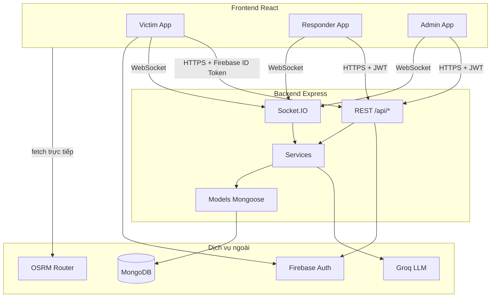
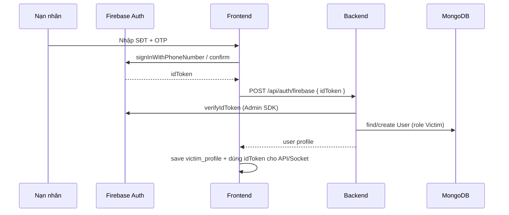
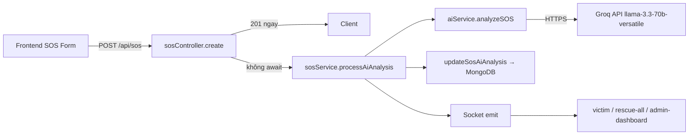
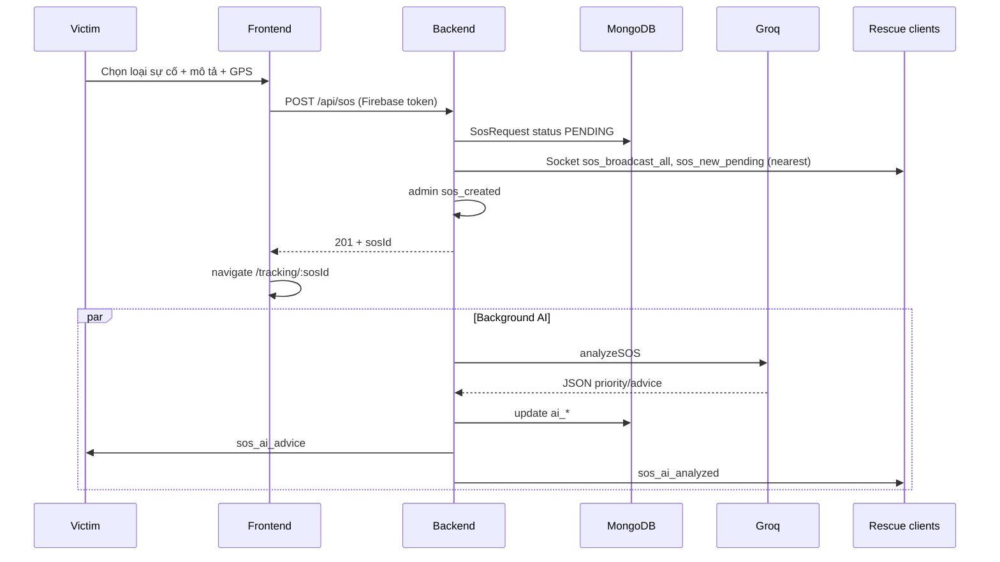
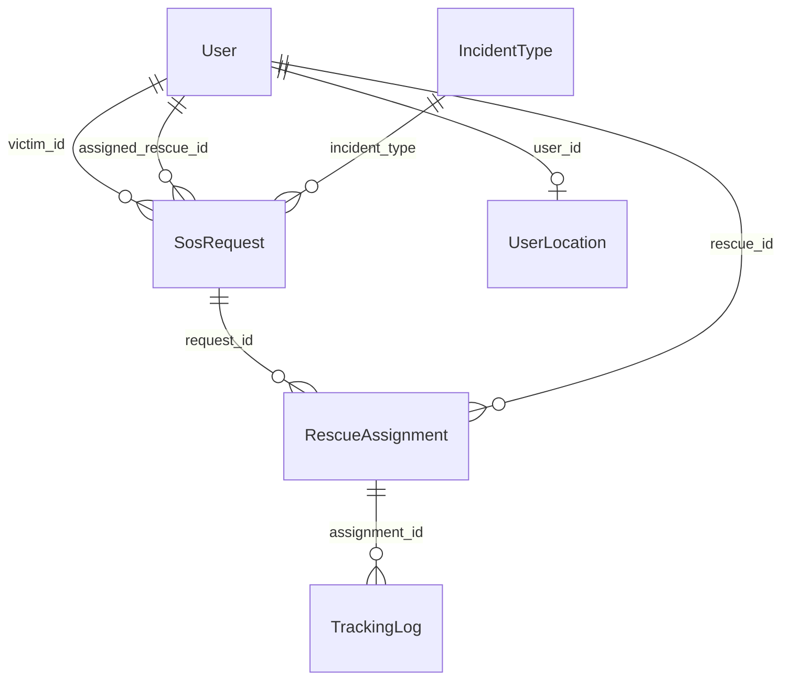

# Hệ thống SOS Cứu trợ — Tài liệu kỹ thuật & thuyết trình

> Tài liệu mô tả codebase **Backend** (Node.js/Express) và **Frontend** (React/Vite) tại thời điểm khảo sát. Dùng để thuyết trình, trả lời hội đồng và đặt câu hỏi phản biện.

---

## 1. Tổng quan hệ thống

### 1.1 Mục tiêu

Ứng dụng điều phối **yêu cầu cứu trợ khẩn cấp (SOS)** với ba nhóm người dùng:

| Vai trò | Đăng nhập | Giao diện chính |
|---------|-----------|-----------------|
| **Victim (Nạn nhân)** | Firebase Phone OTP | `/`, `/sos`, `/tracking/:sosId` |
| **Rescue (Đội cứu hộ)** | Email + mật khẩu → JWT nội bộ | `/responder`, `/responder/tracking/:sosId` |
| **Admin** | Email + mật khẩu → JWT | `/admin/*` (dashboard, incidents, users, history) |

### 1.2 Stack công nghệ

| Tầng | Công nghệ |
|------|-----------|
| Frontend | React 19, Vite, React Router, Tailwind, Leaflet/react-leaflet, Axios, Socket.IO client, Firebase Auth SDK |
| Backend | Express 5, MongoDB (Mongoose), Socket.IO, Firebase Admin SDK, Groq API (LLM) |
| Bản đồ | OpenStreetMap tiles + **OSRM** (routing) |
| Realtime | **Socket.IO** (WebSocket + polling fallback) |

### 1.3 Sơ đồ kiến trúc tổng thể



---

## 2. Mô hình MVC trong dự án

Dự án **không** dùng MVC “cứng” của framework (như Spring MVC), mà là **MVC phân tầng kiểu Node/Express**:

### 2.1 Backend — MVC mapping

| Lớp MVC | Thư mục / file | Trách nhiệm |
|---------|----------------|------------|
| **Model** | `Backend/src/models/*.js` | Schema MongoDB: `User`, `SosRequest`, `RescueAssignment`, `UserLocation`, `TrackingLog`, `IncidentType`, … |
| **View** | *(không có server-side view)* | API trả JSON; “view” nằm ở React |
| **Controller** | `Backend/src/controllers/*.js` | Nhận HTTP request, validate input, gọi service, trả `res.json()`, emit Socket |
| **Service** | `Backend/src/services/*.js` | Business logic: SOS, tracking, team, AI, simulation |
| **Routes** | `Backend/src/routes/*.js` | Map URL → controller + middleware |
| **Middleware** | `Backend/src/middleware/authMiddleware.js` | `requireAuth`, `attachAuthUser` |

**Luồng một request REST điển hình:**

```
Client → Route → requireAuth → attachAuthUser → Controller → Service → Model (MongoDB) → JSON response
```

Ví dụ tạo SOS:

```
POST /api/sos
  → sosRoutes.js
  → sosController.create
  → sosService.createSos + processAiAnalysis (background)
  → SosRequest.create(...)
```

### 2.2 Frontend — tương đương MVC

| Khái niệm | Thư mục | Vai trò |
|----------|---------|---------|
| **View** | `Frontend/src/page/**`, `components/**` | UI, map, form |
| **Controller logic** | Hooks trong page + `services/api/*` | Gọi API, lắng nghe socket, cập nhật state |
| **Model (client)** | State React + `localStorage` (`victim_profile`, `auth_user`, `auth_token`) | Dữ liệu phiên làm việc |

Frontend **không** gọi MongoDB trực tiếp — mọi dữ liệu nghiệp vụ qua **REST** hoặc **Socket.IO**.

---

## 3. Kết nối Frontend ↔ Backend

### 3.1 REST API (Axios)

File trung tâm: `Frontend/src/services/api/index.js`

- **Base URL:** `VITE_API_URL` (mặc định `http://localhost:3001/api`)
- **Interceptor gắn token:**
  1. Nếu có `localStorage.auth_token` → **JWT** (Admin/Rescue)
  2. Ngược lại → **Firebase ID token** từ `auth.currentUser.getIdToken()` (Victim)

Backend mount routes trong `server.js`:

| Prefix | File route | Chức năng |
|--------|------------|-----------|
| `/api/sos` | `sosRoutes.js` | Tạo/hủy SOS, gán đội, lịch sử |
| `/api/tracking` | `trackingRoutes.js` | Tracking, nhận nhiệm vụ, GPS, stage |
| `/api/teams` | `teamRoutes.js` | Đội cứu hộ, vị trí, tìm gần nhất |
| `/api/auth` | `authRoutes.js` | Login email, đồng bộ Firebase phone |
| `/api/users` | `userRoutes.js` | Quản lý user (admin) |

**CORS:** Backend đọc `FRONTEND_ORIGINS` / `FRONTEND_URL`, cho phép credentials.

### 3.2 Socket.IO (realtime)

| Cấu hình | Giá trị |
|----------|---------|
| Client | `Frontend/src/services/socket.js` |
| URL | `VITE_SOCKET_URL` hoặc suy ra từ `VITE_API_URL` (bỏ `/api`) |
| Auth handshake | `{ token, userId, userRole }` |

Backend xác thực socket (`server.js`):

1. Thử **Firebase Admin** `verifyIdToken(token)`
2. Fallback **JWT** `jwt.verify(token, JWT_SECRET)`
3. Gán role → join room: `victim-{id}`, `rescue-{id}`, `rescue-all`, `admin-dashboard`, `sos-{sosId}`

**Vì sao cần cả REST và Socket?**

- REST: thao tác có phản hồi rõ (tạo SOS, assign, lấy tracking lần đầu)
- Socket: push realtime (vị trí cứu hộ, AI xong, SOS mới, đổi stage) — giảm polling

### 3.3 Biến môi trường quan trọng

**Backend `.env` (ý nghĩa, không commit secret):**

- `MONGO_URI` — MongoDB
- `JWT_SECRET`, `JWT_EXPIRES_IN`
- `GROQ_API_KEY` — AI phân tích SOS
- `FIREBASE_SERVICE_ACCOUNT_*` — verify token nạn nhân
- `FRONTEND_ORIGINS` — CORS
- `PORT` (mặc định 3001)

**Frontend `.env`:**

- `VITE_API_URL`, `VITE_SOCKET_URL`
- `VITE_FIREBASE_*` — Firebase client
- `VITE_ORS_API_KEY` — (tùy chọn) OpenRouteService fallback

---

## 4. Firebase — dạng tích hợp hiện tại

### 4.1 Vai trò của Firebase

Firebase **chỉ dùng cho Authentication (Phone OTP)** của nạn nhân — **không** lưu SOS/tracking trên Firestore trong codebase hiện tại.

| Thành phần | File | Việc làm |
|------------|------|----------|
| Client SDK | `Frontend/src/lib/firebase.js` | `initializeApp`, `getAuth`, emulator/testing flags |
| OTP UI flow | `Frontend/src/services/auth/phoneAuth.js` | `signInWithPhoneNumber`, `confirmOtp` → `idToken` |
| Đồng bộ user | `POST /api/auth/firebase` | Backend verify token → tạo/cập nhật `User` role `Victim` trong **MongoDB** |
| Admin SDK | `Backend/src/config/firebaseAdmin.js` | `verifyIdToken` cho REST + Socket |

### 4.2 Luồng đăng nhập nạn nhân



### 4.3 Staff (Admin / Rescue)

- **Không** qua Firebase OTP
- `POST /api/auth/login-email` → **JWT nội bộ** (`JWT_SECRET`)
- Token lưu `localStorage.auth_token`, user lưu `auth_user`

### 4.4 Chế độ dev

- Auth Emulator: `VITE_FIREBASE_AUTH_EMULATOR_HOST`
- Số test: `VITE_FIREBASE_DEV_TESTING=true`

---

## 5. Bản đồ (Map) — kết nối và hiển thị

### 5.1 Thư viện

- **Leaflet** + **react-leaflet**
- Tile: **OpenStreetMap** (`tile.openstreetmap.org`)
- Component tái sử dụng: `Frontend/src/components/Map/index.jsx` (2 marker: nạn nhân đỏ, cứu hộ xanh)
- Trang tracking nâng cao: `TrackingView.jsx`, `TrackingPage_Rescue/index.jsx` — marker custom CSS, `Polyline` tuyến đường, animation marker

### 5.2 Nguồn tọa độ

| Đối tượng | Nguồn |
|-----------|--------|
| Nạn nhân lúc gửi SOS | `navigator.geolocation` trên trang Requester |
| Vị trí nạn nhân (cập nhật) | `PATCH /api/sos/:id/victim-location` |
| Vị trí cứu hộ “home base” | `UserLocation` collection, `PATCH /api/teams/:id/location` |
| Vị trí cứu hộ khi đang nhiệm vụ | `RescueAssignment.current_location` qua socket/API tracking |

### 5.3 GeoJSON trong MongoDB

Tọa độ lưu dạng **GeoJSON Point**: `[longitude, latitude]` (chuẩn MongoDB 2dsphere).

Index: `sosRequestSchema.index({ location: "2dsphere" })`.

---

## 6. Tìm đường, thuật toán, ETA và quãng đường

### 6.1 Phân biệt ba bài toán khác nhau

| Bài toán | Cách giải trong hệ thống | Thuật toán thực tế |
|----------|--------------------------|-------------------|
| **Tìm đội cứu hộ gần nhất** | `teamService.findNearestTeam` | MongoDB **`$near`** trên index `2dsphere` (truy vấn không gian, không phải A*) |
| **Ước lượng khoảng cách/ETA realtime** khi cứu hộ di chuyển | `trackingService.calculateDistance` + `calculateETA` | **Haversine** (đường chim bay) + tốc độ cố định **40 km/h** |
| **Vẽ tuyến đường lái xe trên map** | `getOSRMRoute` (frontend) / `fetchOSRMRoute` (simulation backend) | Gọi API **OSRM** — engine routing dùng **Contraction Hierarchies** (và/hoặc MLD tùy profile); **không** tự implement A* / Dijkstra trong repo |

> **Lưu ý thuyết trình:** Comment cũ trong `sosService.js` ghi “Gemini” nhưng routing AI SOS thực tế dùng **Groq + Llama 3.3 70B** (`aiService.js`). Đừng nhầm với Google Gemini trừ khi đã đổi code.

### 6.2 Haversine (khoảng cách chim bay)

**Backend** — `trackingService.js`:

```javascript
// R = 6371 km, kết quả làm tròn 3 chữ số thập phân
calculateDistance(lat1, lng1, lat2, lng2)
```

**Frontend** — `apiRouting.js` — `haversineDistance()` tương tự (dùng cho fallback).

### 6.3 ETA

| Ngữ cảnh | Công thức | Tham số |
|----------|-----------|---------|
| Backend tracking realtime | `(distanceKm / 40) * 60` phút, `Math.ceil` | `avgSpeedKmh = 40` |
| Frontend fallback (không OSRM) | `(distanceKm / 30) * 60`, tối thiểu 2 phút | `avgSpeed = 30` |
| Frontend/OSRM (hiển thị route) | `route.duration / 60` từ OSRM | Theo graph đường bộ thực tế |

**Tự động đổi stage theo khoảng cách** (`determineStage`):

- `distanceKm ≤ 0.05` (~50m) và stage `ASSIGNED`/`MOVING` → **`ARRIVED`**
- `distanceKm > 0.05` và stage `ASSIGNED` → **`MOVING`**

### 6.4 OSRM — “tìm đường nhanh” trên bản đồ

File: `Frontend/src/services/api/apiRouting.js`

```
GET https://router.project-osrm.org/route/v1/driving/{lng1},{lat1};{lng2},{lat2}?overview=full&geometries=polyline
```

- Trả về `distance` (mét), `duration` (giây), geometry encoded polyline
- `decodePolyline()` giải mã → vẽ `Polyline` trên Leaflet
- Chuỗi fallback: **OSRM → OpenRouteService (nếu có key) → Haversine thẳng**

**Simulation** (`simulationService.js`): lấy path OSRM (geojson), nội suy từng mét theo tốc độ (mặc định 70 km/h) để demo di chuyển cứu hộ — hữu ích khi demo không có GPS thật.

### 6.5 Không có A* trong codebase

Nếu hội đồng hỏi “sao không dùng A*?” — trả lời:

- Hệ thống **ủy quyền routing graph** cho OSRM (dữ liệu OSM đã preprocess)
- Tự implement A* trên toàn quốc/thành phố là không khả thi cho đồ án; trade-off hợp lý cho sản phẩm web
- Phần “gần nhất” dùng **MongoDB geospatial**, phù hợp với fleet nhỏ

---

## 7. AI — tích hợp sâu

### 7.1 Mục đích

Sau khi nạn nhân gửi SOS (loại sự cố + mô tả), AI phân tích để:

| Output | Ai nhận | Lưu DB |
|--------|---------|--------|
| `priority_score` (1–10), `priority_label` | Admin, Rescue | `ai_priority_*` |
| `situation_summary` | Rescue, Admin | `ai_situation_summary` |
| `rescue_summary` | Đội cứu hộ | `ai_rescue_summary` |
| `victim_advice` | Nạn nhân | `ai_suggestion` |
| `category` | Hệ thống | `ai_category` |

### 7.2 Tầng code (layer)



| Tầng | File | Ghi chú |
|------|------|---------|
| **Presentation** | `SOSform.jsx`, `TrackingView.jsx` (icon Brain, advice) | Hiển thị kết quả socket/API |
| **API / Orchestration** | `sosController.create` | Trả 201 trước, AI chạy **background** |
| **Domain service** | `sosService.processAiAnalysis` | Resolve tên loại sự cố, fallback nếu AI lỗi |
| **AI adapter** | `aiService.analyzeSOS` | Prompt tiếng Việt, parse JSON, cache 1h |
| **Persistence** | `SosRequest` model | Các field `ai_*` |
| **Realtime** | `server.js` + emit trong `processAiAnalysis` | Events bên dưới |

### 7.3 Provider và model

- API: `https://api.groq.com/openai/v1/chat/completions`
- Model: **`llama-3.3-70b-versatile`**
- `temperature: 0.2`, `max_tokens: 500`
- System prompt ép output **JSON thuần** (priority, summaries, advice)
- **Cache in-memory** `Map` key = `incidentType + 120 ký tự đầu mô tả`, TTL 1 giờ
- Retry: tối đa 2 lần, delay 2s
- Không có `GROQ_API_KEY` → `null` → fallback priority trung bình + socket vẫn broadcast

### 7.4 Socket events AI

| Event | Room | Payload chính |
|-------|------|----------------|
| `sos_ai_analyzed` | `rescue-all`, `admin-dashboard` | priority, summaries, situation |
| `sos_ai_advice` | `victim-{victimId}` | `victim_advice`, label |

Frontend lắng nghe: `TrackingView.jsx`, `TrackingPage_Rescue/index.jsx`, `ResponderMissionBoard` (qua priority trên list).

### 7.5 Thiết kế đáng nói khi bảo vệ

1. **Non-blocking:** SOS được tạo và broadcast ngay; AI không chặn UX nạn nhân.
2. **Graceful degradation:** Fallback khi API lỗi / thiếu key.
3. **Cache:** Giảm chi phí và latency cho mô tả trùng.
4. **Tách payload:** Nạn nhân chỉ nhận advice; rescue nhận operational summary.

---

## 8. Luồng nghiệp vụ chi tiết

### 8.1 Luồng gửi SOS (Victim)



### 8.2 Luồng nhận nhiệm vụ (Rescue)

1. Rescue mở `/responder` — socket join `rescue-all`
2. Thấy SOS qua `getAllSos` + realtime `sos_broadcast_all`
3. Bấm nhận → `PATCH /api/sos/:id/assign` với `rescue_id`
4. Backend: tạo `RescueAssignment` stage `ASSIGNED`, SOS → `ASSIGNED`
5. Socket: `sos_assigned`, `rescue_accepted` (victim)
6. `POST /api/tracking/accept-mission` → stage `MOVING`
7. Navigate `/responder/tracking/:sosId`
8. GPS: `socket.emit('responder_location_update')` hoặc `POST /api/tracking/location`
9. Đổi stage thủ công: `PATCH /api/tracking/stage` hoặc socket `responder_stage_change`
10. `COMPLETED` → SOS `RESOLVED`

### 8.3 Luồng theo dõi (Victim tracking page)

1. `GET /api/sos/:id` + `GET /api/tracking/current/by-sos/:sosId`
2. `reinitSocketForTrackingPersona('victim')`, `join_sos_room`
3. Lắng nghe: `victim_tracking_update`, `sos_room_update`, `rescue_accepted`, `sos_ai_advice`
4. Vẽ route: `getOSRMRoute(rescue, victim)` khi có đủ 2 điểm
5. Hiển thị ETA/distance từ socket (backend Haversine) — có thể khác ETA trên polyline OSRM

### 8.4 Admin

- **Dashboard / PDF export** — thống kê
- **Incident management** — danh sách SOS, filter, modal chi tiết
- **Users** — CRUD user rescue/admin
- **History** — SOS đã xử lý
- Socket room `admin-dashboard`: `sos_created`, `location_update`, `stage_changed`, `sos_ai_analyzed`
- Trang `AdminTrackingPage` tạm redirect về incidents (comment trong `App.jsx`)

### 8.5 Trạng thái (state machine)

**SosRequest.status:** `PENDING` → `ASSIGNED` → `IN_PROGRESS` → `RESOLVED` | `CANCELLED`

**RescueAssignment.stage:** `ASSIGNED` → `MOVING` → `ARRIVED` → `RESCUING` → `COMPLETED` | `CANCELLED`

`updateRescueStage` có **validTransitions** — chặn nhảy stage bất hợp lệ.

---

## 9. Mô hình dữ liệu chính



Collections MongoDB (tên có thể override trong model):

- `users`
- `sos_requests`
- `rescue_assignments`
- `user_locations`
- `tracking_logs`
- `incident_types`

---

## 10. Điểm mạnh — đáng chú ý khi chấm điểm

1. **Kiến trúc rõ ràng:** Tách routes / controllers / services / models; frontend tách `services/api` theo domain.
2. **Realtime end-to-end:** Socket room theo role + theo từng `sosId`; đồng bộ victim–rescue–admin.
3. **Auth kép hợp lý:** Firebase cho mass user (OTP), JWT cho staff — một middleware thống nhất.
4. **Geospatial thực tế:** `2dsphere`, `$near` tìm đội gần; GeoJSON chuẩn.
5. **AI không block critical path:** SOS tạo trong vài trăm ms; AI bổ sung sau.
6. **Routing sản phẩm thật:** OSRM + polyline trên map, không chỉ khoảng cách thẳng.
7. **UX tracking:** Smooth marker animation, stage workflow, cancel window, completion popup.
8. **Quan sát vận hành:** `TrackingLog`, `stage_history`, simulation cho demo.
9. **Đa vai trò một codebase:** Requester / Responder / Admin với guard `StaffRoleGuard`.
10. **Triển khai:** Frontend `vercel.json`; backend hỗ trợ env Firebase base64 cho Render/hosting.

---

## 11. Hạn chế thật — nên biết trước hội đồng

| Chủ đề | Thực tế |
|--------|---------|
| ETA realtime vs map | Backend dùng Haversine 40 km/h; map dùng OSRM — **có thể lệch** |
| `total_distance_km` | Logic cộng dồn trong `updateRescueLocation` có thể **không** phải quãng đường odometer chuẩn |
| OSRM public | `router.project-osrm.org` giới hạn rate — production nên self-host |
| AI phụ thuộc Groq | Cần key; không on-premise |
| Team routes | `GET /teams/nearest` **không** bắt buộc auth trong `teamRoutes` — cân nhắc bảo mật |
| Firebase ≠ primary DB | Mọi nghiệp vụ trên MongoDB — Firebase chỉ identity |

---

## 12. Gợi ý câu hỏi phản biện & hướng trả lời

| Câu hỏi | Gợi ý trả lời ngắn |
|---------|---------------------|
| Vì sao MongoDB mà không Firebase Realtime DB? | Cần query phức tạp, geospatial, lịch sử; Firebase chỉ auth OTP. |
| MVC ở đâu khi frontend là SPA? | MVC backend chuẩn; frontend: View = components, logic = hooks + api services. |
| Thuật toán tìm đường? | OSRM (graph preprocessing); gần nhất = `$near`; realtime ETA = Haversine. |
| AI dùng model gì? | Groq Llama 3.3 70B; JSON structured output; async sau create SOS. |
| Đảm bảo realtime? | Socket.IO rooms + emit sau mỗi location/stage; client rejoin `sos-{id}`. |
| Nếu mất mạng? | REST retry; socket reconnection 5 lần; tracking lấy lại qua GET current. |
| Phân quyền? | `requireAuth` + `attachAuthUser`; victim chỉ sửa/hủy SOS của mình; rescue chỉ assignment của mình. |
| Scale? | Horizontal socket cần Redis adapter; MongoDB replica; OSRM riêng. |

---

## 13. Bảng Socket events tham khảo

| Event | Hướng | Mô tả |
|-------|-------|-------|
| `join_sos_room` / `leave_sos_room` | Client → Server | Vào room theo SOS |
| `responder_location_update` | Rescue → Server | GPS + tính distance/ETA |
| `victim_tracking_update` | Server → Victim | ETA, stage, vị trí cứu hộ |
| `sos_room_update` | Server → Room sos-* | Cập nhật chung |
| `responder_stage_change` | Rescue → Server | Đổi stage thủ công |
| `sos_broadcast_all` | Server → rescue-all | SOS mới |
| `sos_assigned` | Server | Đã có đội nhận |
| `rescue_accepted` | Server → Victim | Thông báo tiếp nhận |
| `sos_ai_analyzed` / `sos_ai_advice` | Server | Kết quả AI |
| `stage_changed` / `location_update` | Server → admin-dashboard | Giám sát |

---

## 14. Chạy hệ thống (tóm tắt)

```bash
# Backend
cd Backend && npm install && npm run dev
# cần MongoDB + .env (MONGO_URI, JWT_SECRET, Firebase admin, GROQ_API_KEY)

# Frontend
cd Frontend && npm install && npm run dev
# .env VITE_API_URL=http://localhost:3001/api
```

Seed dữ liệu (nếu cần): `npm run seed:roles`, `seed:rescue-test`, … trong Backend.

---

## 15. File then chốt nên nhớ

| Chủ đề | File |
|--------|------|
| Server + Socket | `Backend/src/server.js` |
| AI | `Backend/src/services/aiService.js`, `sosService.processAiAnalysis` |
| Tracking / ETA | `Backend/src/services/trackingService.js` |
| Routing map | `Frontend/src/services/api/apiRouting.js` |
| API client | `Frontend/src/services/api/index.js` |
| Firebase | `Frontend/src/lib/firebase.js`, `Backend/src/config/firebaseAdmin.js` |
| Auth | `Backend/src/routes/authRoutes.js`, `authMiddleware.js` |
| SOS create | `Backend/src/controllers/sosController.js` |
| Map UI | `Frontend/src/page/Requester/TrackingView.jsx` |

---

*Tài liệu được sinh từ phân tích trực tiếp mã nguồn dự án KLTN.*
